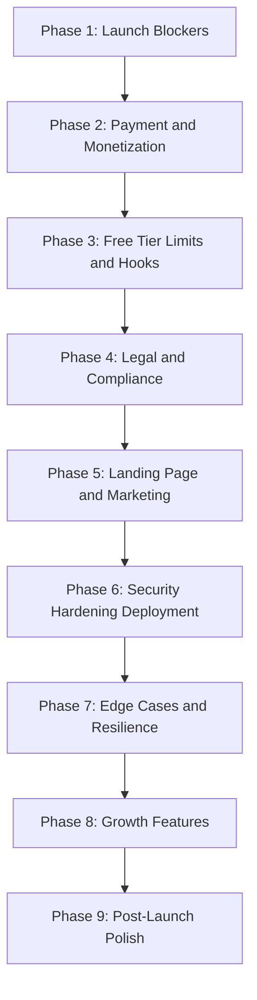
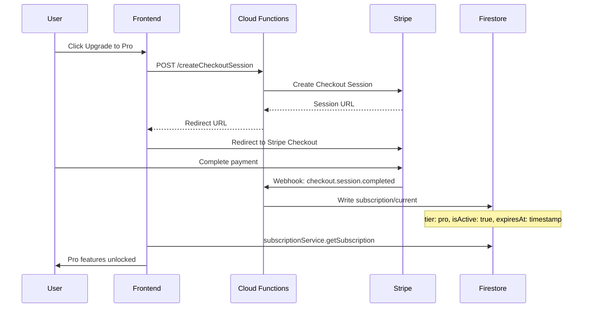
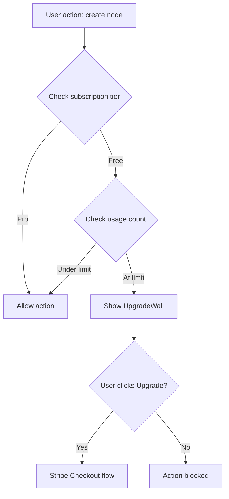

# ActionStation — Production Launch Plan

> Comprehensive phase-wise plan covering all pending items from development to production.
> Ordered from **most critical** (launch blockers) to **least critical** (post-launch polish).
> Created: 26 March 2026

---

## Current State Summary

| Area | Status | Key Gaps |
|------|--------|----------|
| Core App | ✅ Functional | Canvas, nodes, edges, AI, search, clustering, KB all working |
| Auth | ✅ Working | Google OAuth, session management, account deletion |
| Security | ⚠️ Code complete, deploy pending | WAF script ready (run once); Turnstile integrated (needs env vars); Monitoring script ready (run once) |
| Subscription | ⚠️ Skeleton only | Types + store exist; no payment provider, no billing UI, no enforcement |
| Free Tier Limits | ✅ Complete | 5 workspaces, 12 nodes, 60 AI/day, 50 MB storage enforced |
| Payment System | ❌ Missing | No Stripe/Razorpay integration; no checkout, no webhooks |
| Legal Pages | ❌ Missing | Terms of Service, Privacy Policy, Cookie Policy not created |
| Landing Page | ❌ Missing | No public marketing page; login page is the only entry point |
| Onboarding | ✅ Working | Walkthrough, coach marks, welcome screen, demo nodes |
| Share/Remix | ❌ Not built | Phase 10 planned but not implemented |
| Templates | ❌ Not built | Phase 9 planned but not implemented |
| Analytics Consent | ❌ Missing | PostHog fires without explicit user consent; no cookie banner |
| Error Monitoring | ✅ Working | Sentry + PostHog + Web Vitals configured |
| CI/CD | ✅ Working | Full pipeline with audit, Gitleaks, Lighthouse |
| Uptime Monitoring | ❌ Missing | Health endpoint exists but no external monitor configured |

---

## Phase-Wise Launch Plan

---

## Phase 1: Launch Blockers — Critical Infrastructure

> Items that will cause the app to **break or be unusable** in production if not addressed.

### 1.1 Deploy Environment Variables to GitHub Secrets

**Status:** `VITE_CLOUD_FUNCTIONS_URL` and `VITE_GOOGLE_CLIENT_ID` are now in [`deploy.yml`](../.github/workflows/deploy.yml:43) but the actual GitHub Secrets must be configured in the repository settings.

**Action items:**
- Verify all 10 secrets are set in GitHub repo settings
- Test a deploy to staging/preview channel to confirm AI features work
- Confirm Calendar OAuth initializes correctly

### 1.2 Domain and DNS Configuration

**Action items:**
- Register and configure production domain — `actionstation.so` or chosen domain
- Point DNS A record to Firebase Hosting IP or Cloud Armor LB IP
- Configure custom domain in Firebase Hosting console
- Update [`firebase.json`](../firebase.json:35) CSP `connect-src` to include production domain
- Update CORS origins in [`functions/src/utils/corsConfig.ts`](../functions/src/utils/corsConfig.ts) to include production domain
- Configure Google OAuth redirect URIs for production domain in Google Cloud Console

### 1.3 Firebase App Check Enforcement

**Action items:**
- Enable App Check enforcement in Firebase Console for Firestore, Storage, and Cloud Functions
- Verify reCAPTCHA v3 provider is configured
- Test that legitimate requests pass and unauthorized direct API calls are blocked

### 1.4 Immutable Backup Bucket Setup

**Action items:**
- Run [`scripts/setup-immutable-backups.sh`](../scripts/setup-immutable-backups.sh) to create the immutable backup bucket
- Update `BACKUP_BUCKET` in [`functions/src/firestoreBackup.ts`](../functions/src/firestoreBackup.ts) to point to the new bucket
- Verify daily backup function triggers correctly

### 1.5 Uptime Monitoring

**Action items:**
- Set up external uptime monitor — BetterUptime, Checkly, or UptimeRobot
- Point it at the [`/health`](../functions/src/health.ts) Cloud Function endpoint
- Configure alerting — email + Slack/Discord notification on downtime
- Add production URL ping check — verify Firebase Hosting responds with 200

---

## Phase 2: Payment System and Monetization

> No revenue without this. The subscription skeleton exists but has zero payment integration.

### 2.1 Choose and Integrate Payment Provider

**Current state:** [`subscriptionService.ts`](../src/features/subscription/services/subscriptionService.ts) reads from Firestore `users/{userId}/subscription/current` but nothing writes to it except dev bypass.

**Action items:**
- Choose payment provider — Stripe recommended for global reach; Razorpay if India-first
- Create Stripe account, configure products and pricing
- Define pricing tiers:
  - **Free**: Limited workspaces, limited nodes, limited AI calls
  - **Pro**: Unlimited workspaces, unlimited nodes, higher AI limits, premium features

### 2.2 Stripe Checkout Integration

**Action items:**
- Create Cloud Function `createCheckoutSession` — generates Stripe Checkout session
- Create Cloud Function `stripeWebhook` — handles `checkout.session.completed`, `customer.subscription.updated`, `customer.subscription.deleted`
- Webhook writes to `users/{userId}/subscription/current` in Firestore — this is the SSOT that [`subscriptionService.ts`](../src/features/subscription/services/subscriptionService.ts) already reads
- Add webhook signature verification using Stripe signing secret
- Store Stripe customer ID in user document for future billing portal access

### 2.3 Billing Portal and Subscription Management UI

**Action items:**
- Create Cloud Function `createBillingPortalSession` — redirects to Stripe Customer Portal
- Build `PricingCard` component showing Free vs Pro comparison
- Build `UpgradePrompt` component — shown when free user hits a gated feature
- Add subscription status display in [`AccountSection.tsx`](../src/app/components/SettingsPanel/sections/AccountSection.tsx) — current plan, renewal date, manage button
- Add `Manage Subscription` button that opens Stripe billing portal

### 2.4 Subscription Webhook Security

**Action items:**
- Stripe webhook Cloud Function must verify `stripe-signature` header
- Webhook endpoint must be excluded from bot detection — Stripe sends automated requests
- Add idempotency — webhook may fire multiple times for same event
- Log all subscription state changes via [`securityLogger.ts`](../functions/src/utils/securityLogger.ts)

---

## Phase 3: Free Tier Limits and User Hooks

> Without limits, every user gets unlimited Pro features for free. Without hooks, there is no reason to upgrade.

**Status: ✅ COMPLETE** — Implemented on `feature/free-tier-limits`, merged to `main`.

### 3.1 Define and Enforce Free Tier Limits

**Implemented limits** (SSOT: `FREE_TIER_LIMITS` in `src/features/subscription/types/tierLimits.ts`):

| Resource | Free | Pro |
|----------|------|-----|
| Workspaces per user | **5** | Unlimited |
| Nodes per workspace | **12** | Unlimited |
| AI generations/day | **60** | Unlimited |
| Storage per user | **50 MB** | Unlimited |
| KB entries | **No cap** | No cap |

- ✅ `FREE_TIER_LIMITS` constant in `tierLimits.ts` — SSOT for all values
- ✅ `TierLimitsProvider` / `useReducer` state machine — isolated from Zustand stores
- ✅ `useTierLimits` hook — scalar selectors, syncs workspace/node counts via `useEffect`
- ✅ Workspace creation limit in `useWorkspaceOperations.ts` → `UpgradeWall` modal
- ✅ Node creation limit in `useNodeCreationGuard.ts` → toast (used by `useAddNode`, `useIdeaCardDuplicateAction`, `branchFromNode`)
- ✅ AI generation limit in `geminiProxy.ts` (server-authoritative) + `useNodeGeneration.ts` (optimistic UI)
- ✅ Storage usage tracking in `storageUsageService.ts` (fire-and-forget per upload)

### 3.2 Upgrade Prompts and Paywalls

- ✅ `UpgradeWall` component — modal shown when workspace limit hit
- ✅ `UsageMeter` component — progress bar for usage counts
- ✅ Toast with upgrade CTA for node and AI limits (`toastWithAction`)
- ✅ `UpgradePrompt` component — generic upgrade prompt (pre-existing)
- ⬜ Add upgrade CTA in sidebar footer (deferred — limits trigger in-context prompts)

### 3.3 Strategy: Generous Free Tier

**Decision: Generous free tier forever** (no time-limited trial).

- Free tier limits are high enough to demonstrate full value before upgrade
- Existing data is always preserved — creation is blocked at limit, not data access
- ✅ Graceful enforcement: toast/modal on creation attempt, no data loss

---

## Phase 4: Legal and Compliance

> Required before any public launch. Missing these can result in legal liability.

### 4.1 Terms of Service Page

**Action items:**
- Create `/terms` route and `TermsOfService` page component
- Cover: acceptable use, account termination, data ownership, liability limitations
- Link from [`LoginPage.tsx`](../src/features/auth/components/LoginPage.tsx:101) — the `termsNote` string already says "By continuing, you agree to our Terms of Service and Privacy Policy" but links nowhere
- Make terms acceptance explicit — checkbox or "By signing in you agree" with clickable links

### 4.2 Privacy Policy Page

**Action items:**
- Create `/privacy` route and `PrivacyPolicy` page component
- Cover: data collected — Firebase Auth profile, workspace data, analytics via PostHog, error tracking via Sentry
- Cover: data storage — Firestore, Firebase Storage, Google Cloud
- Cover: third-party services — Google OAuth, Gemini AI, PostHog, Sentry, Stripe
- Cover: data retention and deletion — account deletion removes all data
- Cover: cookies and local storage usage
- Link from login page and settings

### 4.3 Cookie/Analytics Consent Banner

**Current state:** PostHog analytics fires immediately on load without consent. Sentry error tracking also starts without consent.

**Action items:**
- Create `CookieConsentBanner` component
- On first visit: show banner with Accept/Reject options
- Store consent in `localStorage`
- If rejected: call `posthog.opt_out_capturing()` — the method already exists in [`analyticsService.ts`](../src/shared/services/analyticsService.ts:17)
- Sentry error tracking can remain active without consent — it is a legitimate interest for service reliability
- Respect Do Not Track header

### 4.4 GDPR Data Export

**Current state:** [`useDataExport.ts`](../src/features/workspace/hooks/useDataExport.ts) exports current workspace only as JSON.

**Action items:**
- Extend data export to include ALL user data across ALL workspaces
- Include: user profile, all workspaces, all nodes, all edges, all KB entries, settings
- Provide as downloadable ZIP file
- Add "Export All My Data" button in Account settings
- This satisfies GDPR Article 20 — right to data portability

### 4.5 Account Deletion Completeness

**Current state:** [`deleteAccount`](../src/features/auth/services/authService.ts) exists but needs verification.

**Action items:**
- Verify account deletion removes ALL Firestore data — workspaces, nodes, edges, KB entries, subscription, integrations
- Verify Storage files are cleaned up — all files under `users/{userId}/`
- Add server-side Cloud Function `onUserDeleted` triggered by Firebase Auth user deletion — belt-and-suspenders cleanup
- Log deletion event for compliance audit trail

---

## Phase 5: Landing Page and Marketing Site

> Users need to discover the app before they can use it.

### 5.1 Public Landing Page

**Current state:** No landing page exists. Unauthenticated users see only the login page.

**Action items:**
- Create a public landing page at `/` — hero section, feature highlights, pricing, CTA
- Move login to `/login` route
- Landing page sections:
  - Hero: tagline + screenshot/demo GIF + "Get Started Free" CTA
  - Features: Canvas thinking, AI synthesis, Knowledge Bank, context chains
  - Pricing: Free vs Pro comparison table
  - FAQ section
  - Footer: links to Terms, Privacy, Contact

### 5.2 SEO and Social Sharing

**Current state:** Basic meta tags exist in [`index.html`](../index.html:23) but OG image is just the favicon SVG.

**Action items:**
- Create proper OG image — 1200x630 PNG with app screenshot and branding
- Add structured data — JSON-LD for SoftwareApplication
- Create `sitemap.xml` — update [`robots.txt`](../public/robots.txt) to reference it
- Add canonical URL meta tag
- Ensure landing page content is server-rendered or pre-rendered for SEO — consider Vite SSG plugin

### 5.3 FAQ Section

**Action items:**
- Create FAQ data structure with common questions:
  - "What is ActionStation?"
  - "Is my data private?"
  - "What AI model do you use?"
  - "Can I use it offline?"
  - "How do I cancel my subscription?"
  - "Can I export my data?"
  - "What happens when I hit the free tier limit?"
- Render as accordion component on landing page
- Also accessible from Help button in app

---

## Phase 6: Security Hardening Deployment

> Security infrastructure is built but not all deployed. These items harden the production environment.

### 6.1 Deploy Cloud Armor WAF

**Current state:** [`scripts/setup-cloud-armor.sh`](../scripts/setup-cloud-armor.sh) is ready but not executed.

**Action items:**
- Run the Cloud Armor setup script in production GCP project
- Configure DNS to route through the HTTPS Load Balancer
- Verify OWASP CRS rules are active and not blocking legitimate traffic
- Test with common attack payloads to confirm blocking
- Monitor false positive rate for first 2 weeks

### 6.2 Deploy Turnstile CAPTCHA on Login

**Current state:** ✅ Code complete — `verifyTurnstile.ts` Cloud Function + `useTurnstile.ts` hook + `LoginPage.tsx` fully integrated. Awaiting env var deployment (store `TURNSTILE_SECRET` in Secret Manager, set `VITE_TURNSTILE_SITE_KEY` in CI).

**Action items:**
- Create Cloudflare Turnstile site at dash.cloudflare.com → Zero Trust → Turnstile
- Store `TURNSTILE_SECRET` in Google Cloud Secret Manager
- Add `VITE_TURNSTILE_SITE_KEY` to GitHub Secrets and deploy frontend
- Smoke test: open production login page, observe Turnstile loading and sign-in succeeds

### 6.3 Deploy Monitoring Alerts

**Current state:** [`scripts/setup-monitoring-alerts.sh`](../scripts/setup-monitoring-alerts.sh) exists but not executed.

**Action items:**
- Run monitoring alerts setup script
- Configure Cloud Monitoring alert policies for:
  - 429 spike — rate limit abuse
  - 500 spike — server errors
  - Auth failure spike — credential stuffing
  - Bot detection spike — scanner activity
- Set up notification channels — email, Slack, PagerDuty

### 6.4 Unicode Homoglyph Prompt Injection Hardening

**Current state:** ✅ Code complete — `functions/src/utils/textNormalizer.ts` implements a 3-step pipeline: NFKD decomposition → `\p{Mn}` combining-mark strip → Cyrillic/Greek confusables map. Applied in `promptFilter.ts` before all pattern matching. 56 tests pass (49 normalizer + 7 new homoglyph bypass tests in `promptFilter.test.ts`). See [Decision 31](../MEMORY.md).

**No further action required** — this is a functions-side code change, not a deployment step.

---

## Phase 7: Edge Cases and Resilience

> Items that will not break the app but will cause poor UX or data issues at scale.

### 7.1 Large Workspace Handling

**Action items:**
- Test with 500+ nodes — verify spatial chunking works correctly
- Add user-facing warning when approaching node limits
- Implement progressive loading indicator for large workspaces
- Test autosave performance with 1000+ nodes

### 7.2 Concurrent Session Handling

**Action items:**
- Handle user opening app in multiple tabs — Firestore real-time listeners may conflict
- Add tab leader election — only one tab performs autosave
- Show "Editing in another tab" warning if conflict detected
- Test: open 3 tabs, edit in each, verify no data loss

### 7.3 Network Resilience

**Current state:** Offline queue exists, PWA service worker configured.

**Action items:**
- Test offline → online transition — verify queued saves flush correctly
- Test slow network — 3G simulation, verify no timeout crashes
- Add retry with exponential backoff for failed Firestore writes
- Test airplane mode → reconnect flow end-to-end

### 7.4 Browser Compatibility

**Action items:**
- Test on Chrome, Firefox, Safari, Edge — latest 2 versions
- Test on mobile browsers — Chrome Android, Safari iOS
- Verify `crypto.randomUUID()` polyfill for older browsers if needed
- Test PWA install flow on Android and iOS
- Verify touch interactions on canvas — pinch zoom, drag nodes

### 7.5 Accessibility Audit

**Action items:**
- Run Lighthouse accessibility audit — target score 90+
- Verify keyboard navigation through all major flows
- Verify screen reader compatibility for node creation and editing
- Add ARIA labels to all interactive canvas elements
- Test with VoiceOver on macOS and NVDA on Windows

---

## Phase 8: Growth Features

> Features that drive user acquisition, retention, and upgrade conversion.

### 8.1 Workspace Templates — Phase 9

**Current state:** Fully planned in [`PHASE-9-WORKSPACE-TEMPLATES.md`](../mydocs/PHASE-9-WORKSPACE-TEMPLATES.md) but not implemented.

**Action items:**
- Implement template picker modal on workspace creation
- Ship 5 built-in templates: Project Plan, Research Canvas, Brainstorm Board, Weekly Review, BASB CODE
- Allow saving workspace as custom template — localStorage, max 10
- This reduces blank canvas anxiety and improves activation

### 8.2 Shareable Read-Only Canvas Link — Phase 10A

**Current state:** Planned in [`PHASE-10-SHARE-AND-REMIX.md`](../mydocs/PHASE-10-SHARE-AND-REMIX.md) but not implemented.

**Action items:**
- Implement snapshot service — serialize canvas to JSON, upload to Firebase Storage
- Create `/view/{snapshotId}` route — read-only ReactFlow canvas, no login required
- Add "Share Canvas" button in workspace controls
- Snapshots expire after 30 days
- This is the key "Express" feature for BASB

### 8.3 In-App Feedback and Support

**Action items:**
- Add feedback widget — simple form that sends to a support email or Firestore collection
- Add "Report a Bug" flow — capture screenshot, browser info, send to Sentry or email
- Add changelog/what's new modal — show on first login after update
- Consider Intercom, Crisp, or simple email-based support

### 8.4 Referral and Viral Hooks

**Action items:**
- Add "Invite a friend" feature — share link with referral code
- Reward: both referrer and invitee get 1 extra workspace or 1 week Pro trial
- Track referral conversions in PostHog
- Add social sharing buttons for shared canvas links

### 8.5 Email Notifications

**Action items:**
- Welcome email on signup — Firebase Extensions or SendGrid
- Weekly digest — "You created X nodes this week, synthesized Y insights"
- Subscription expiry reminder — 3 days before Pro expires
- Re-engagement email — "You haven't visited in 7 days"

---

## Phase 9: Post-Launch Polish

> Nice-to-have improvements that enhance the experience but are not launch-critical.

### 9.1 Bundle Size Optimization

**Current state:** Main bundle is 1,161 KB — [`knowledgeBankService.ts`](../src/features/knowledgeBank/services/knowledgeBankService.ts) and `storageService.ts` have static/dynamic import conflicts.

**Action items:**
- Fix static/dynamic import conflict — convert KB hooks to dynamic imports
- Target: main bundle under 800 KB gzipped
- Verify code splitting for all lazy-loaded routes

### 9.2 Performance Monitoring Dashboard

**Action items:**
- Set up PostHog dashboard for key metrics:
  - Daily/weekly active users
  - Nodes created per user per day
  - AI generations per user per day
  - Workspace count distribution
  - Conversion rate: free → pro
- Set up Sentry performance monitoring dashboard
- Track Core Web Vitals trends

### 9.3 Internationalization Preparation

**Current state:** All strings are centralized in [`strings.ts`](../src/shared/localization/strings.ts) — good foundation.

**Action items:**
- Evaluate i18n library — react-intl or i18next
- Extract string keys to JSON format for translator access
- Prioritize: English first, then Hindi, Spanish, French
- This is post-launch but the architecture is ready

### 9.4 Ads Integration — if Applicable

**Action items:**
- Decide if ads are part of the monetization strategy — typically not for productivity SaaS
- If yes: non-intrusive banner in sidebar for free users only
- If no: focus on subscription conversion instead
- Recommendation: skip ads, focus on Pro conversion

### 9.5 Reader Workspace — Phase 11

**Current state:** Planned in [`PHASE-11-READER-WORKSPACE.md`](../mydocs/PHASE-11-READER-WORKSPACE.md) but not implemented.

**Action items:**
- PDF/Image reader with quote extraction
- Focus mode for reading within the canvas
- Post-launch feature — enhances the "Capture" BASB move

---

## Pre-Launch Checklist

A final checklist to run through before flipping the switch:

- [ ] All GitHub Secrets configured and deploy succeeds
- [ ] Production domain configured with SSL
- [ ] Firebase App Check enforced
- [ ] Stripe webhooks verified with test events
- [ ] Free tier limits enforced and tested
- [ ] Terms of Service and Privacy Policy published
- [ ] Cookie consent banner functional
- [ ] GDPR data export tested end-to-end
- [ ] Account deletion verified — all data removed
- [ ] Cloud Armor WAF deployed and tested
- [ ] Turnstile CAPTCHA on login page
- [ ] Monitoring alerts configured
- [ ] Uptime monitor active
- [ ] Immutable backup bucket created
- [ ] Landing page live with pricing
- [ ] OG image and SEO meta tags configured
- [ ] Cross-browser testing complete
- [ ] Accessibility audit score 90+
- [ ] Load test with 100 concurrent users
- [ ] Rollback plan documented

---

## Architecture: Payment Flow

## Architecture: Free Tier Enforcement

---

*Plan created: 26 March 2026 | Based on codebase audit of ActionStation v0.1.0*
